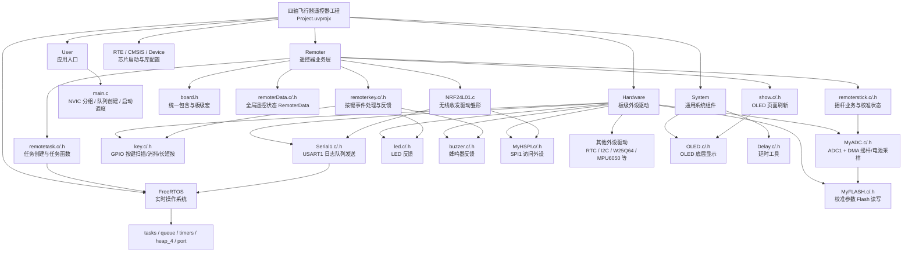
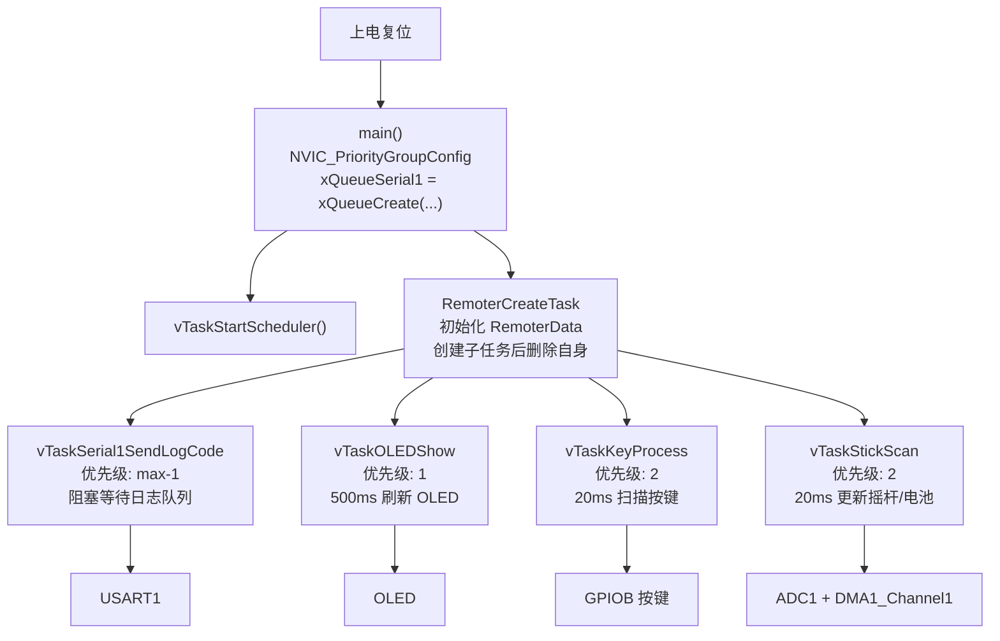
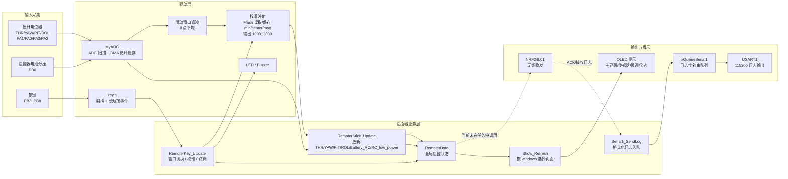
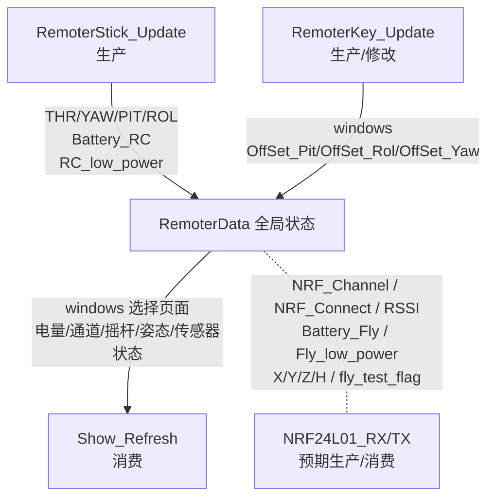

# 项目组织架构图与数据流图

本文档根据当前工程目录和源码生成，重点描述遥控器侧当前已经接入的模块、FreeRTOS 任务和数据流。

## 1. 项目组织架构图

## 2. 运行时任务组织图

## 3. 核心数据流图

## 4. RemoterData 字段流向

## 5. 当前状态备注

- 当前工程入口在 `User/main.c`，只直接创建 `RemoterCreateTask`，实际业务任务由 `Remoter/remotetask.c` 统一创建。
- `RemoterData` 是遥控器业务层的中心状态对象；摇杆任务和按键任务写入，OLED 任务读取。
- 串口日志走 `xQueueSerial1` 队列，`Serial1_SendLog()` 负责入队，`vTaskSerial1SendLogCode()` 负责从队列取出并通过 USART1 发送。
- `NRF24L01.c` 已加入 Keil 工程分组，但当前没有看到对应的 `NRF24L01.h` 文件；同时该文件使用的 `MyHSPI_NRF_CE()` 在当前 `MyHSPI.c/.h` 中尚未定义。它现在更像是待接入的无线驱动模块，还没有被 `remotetask.c` 调度。
- `RemoterData` 中飞行器回传字段，例如 `Battery_Fly`、`Fly_low_power`、`X/Y/Z/H`、`fly_test_flag`，目前主要被 OLED 消费；当前代码里尚未看到稳定的生产者，后续大概率应由 NRF 接收链路写入。
